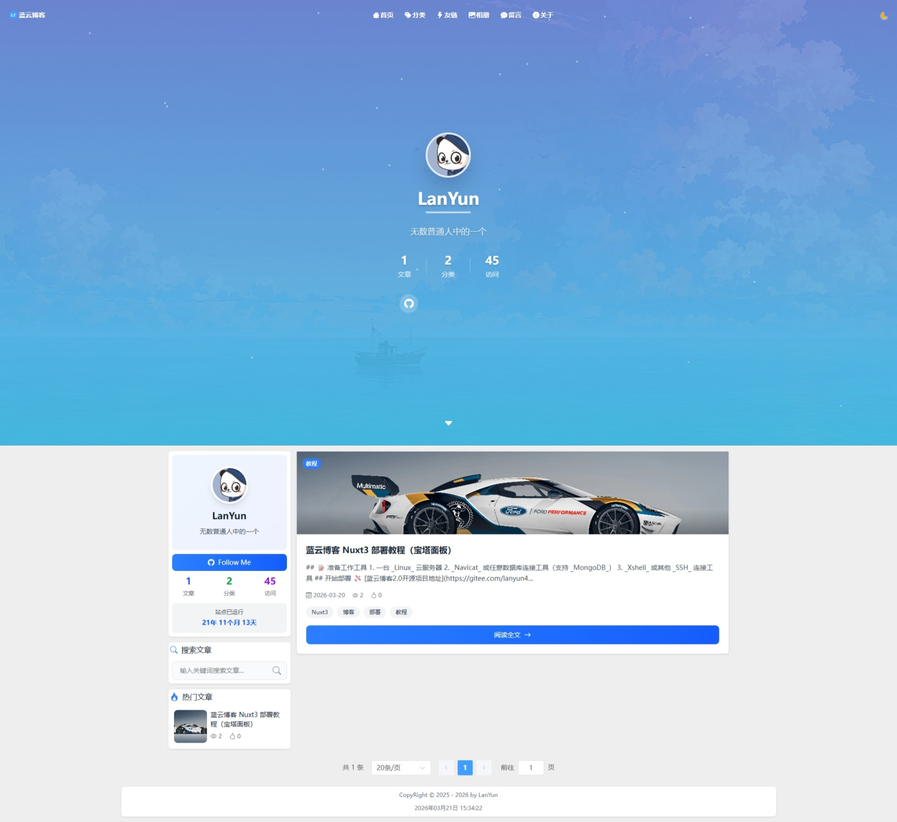
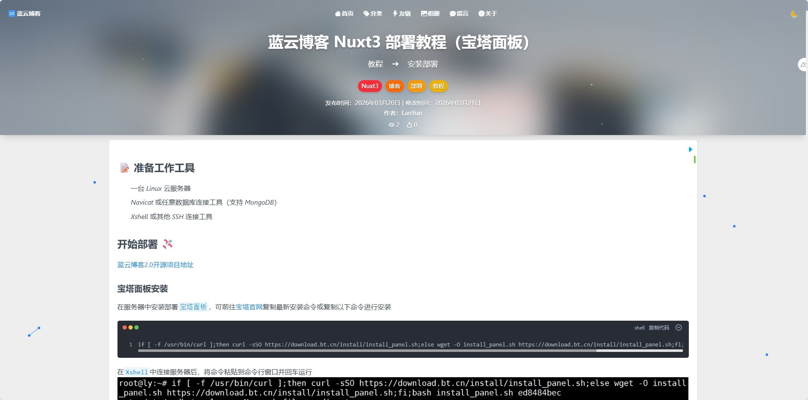
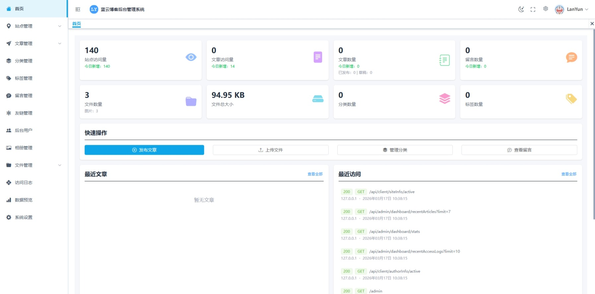
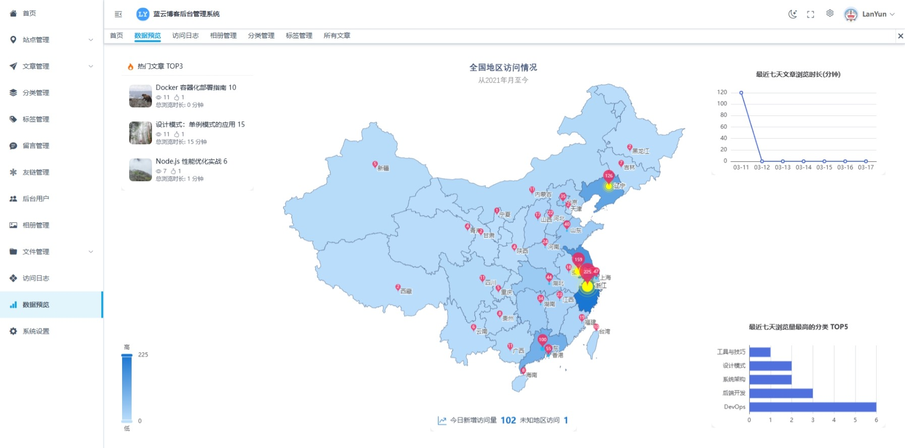

<p align="center">
   
</p>

<h1 align="center" style="font-size: 26px; color: #409EFF;">蓝 云 博 客 2.0</h1>

一个基于 Nuxt 3 的全栈博客系统，集成前台内容展示与后台管理，支持文章、分类、标签、相册、留言、友链、文件管理、访问日志与数据看板等功能。

<p align="center">
   
   
   
   
   
</p>

## 项目特性

- 前台博客：首页、文章列表/详情、分类筛选、相册、留言、友链、关于页
- 后台管理：文章发布与编辑、分类标签管理、管理员与角色管理、站点信息管理
- 文件系统：支持文件上传与图片管理，图片自动转 `webp`，并基于哈希去重
- 安全能力：管理员 JWT 鉴权、验证码校验、会话机制
- 运维能力：访问日志落库、日志文件输出、接口文档自动生成
- 全栈一体：Nuxt 页面 + Nitro API + MongoDB 持久化

## 技术栈

- 前端：`Nuxt 3`、`Vue 3`、`TypeScript`、`Pinia`
- UI/样式：`Element Plus`、`Tailwind CSS`、`SCSS`、`bootstrap-icons`
- 服务端：Nuxt Nitro（`server/api`、`server/middleware`）
- 数据库：`MongoDB` + `Mongoose`
- 文件与图像：`multer`、`sharp`
- 安全与工具：`jsonwebtoken`、`nuxt-auth-utils`、`svg-captcha`、`log4js`、`dayjs`

## 项目截图

> 项目截图位于 `screenshot/` 目录。

### 前台




### 后台




## 目录结构

```text
lyblog/
├─ pages/                 # 前台与后台页面（Nuxt 约定式路由）
├─ components/            # 前端组件
├─ composables/           # 组合式逻辑封装
├─ stores/                # Pinia 状态管理
├─ api/                   # 前端请求封装
├─ server/
│  ├─ api/                # 后端接口（admin/client）
│  ├─ middleware/         # 鉴权、上传、日志、验证码等中间件
│  ├─ models/             # Mongoose 数据模型
│  ├─ plugins/            # 服务端插件（如 MongoDB 连接）
│  ├─ routes/             # 自定义服务端路由
│  └─ utils/              # 服务端工具函数
├─ public/resource/       # 上传后的静态资源
├─ db/lyblog.js           # MongoDB 初始化示例数据
├─ apidoc/                # apidoc 生成结果
└─ nuxt.config.ts         # Nuxt 配置
